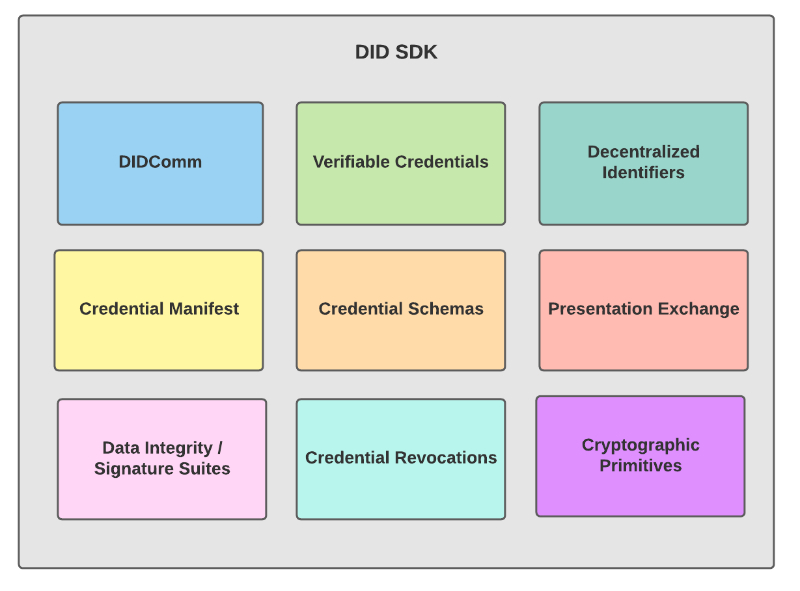

# did-sdk

# Introduction

Named `did-sdk`, this SDK refers to "DID" as **D**ecentralized **ID**entity, not specifically the
[did-core specification](https://www.w3.org/TR/did-core/). The `did-sdk` intends to provide a set of standards-based
primitives for building decentralized identity applications in a modular manner: with limited dependencies between
components.

The image above outlines the SDK's vision. Standards may be added and/or removed. The standards themselves are under
active development, and as such, are subject to change. When possible we aim to call out which versions or revisions of
standards we are building implementations against.

The SDK has not undergone any formal security review or audit, so please use with caution.

# Contributing

This project is fully open source, and we welcome contributions! For more information please see
[CONTRIBUTING](CONTRIBUTING.md). Our current thinking about the development of the library is captured in
[GitHub Issues](https://github.com/TBD54566975/did-sdk/issues).

# Specifications

Here are a set of references to specifications that this library currently supports. It is a dynamic set that will
change as the library evolves.

- [Decentralized Identifiers (DIDs) v1.0](https://www.w3.org/TR/2021/PR-did-core-20210803/) _W3C Proposed Recommendation
  03 August 2021_
- [Verifiable Credentials Data Model v1.1](https://www.w3.org/TR/2021/REC-vc-data-model-20211109/) _W3C Recommendation
  09 November 2021_
- [Verifiable Credentials JSON Schema Specification](https://w3c-ccg.github.io/vc-json-schemas/v2/index.html) _Draft
  Community Group Report, 21 September 2021_

## signature suites

- [Data Integrity 1.0](https://w3c-ccg.github.io/data-integrity-spec) _Draft Community Group Report_
- [Linked Data Cryptographic Suite Registry](https://w3c-ccg.github.io/ld-cryptosuite-registry/) _Draft Community Group
  Report 29 December 2020_
- [JSON Web Signature 2020](https://w3c-ccg.github.io/lds-jws2020) _Draft Community Group Report 09 February 2022_
    - [VC Proof Formats Test Suite, VC Data Model with JSON Web Signatures](https://identity.foundation/JWS-Test-Suite/) _Unofficial Draft 01 February 2022_
    This implementation's compliance with the JWS Test Suite [can be found here](https://identity.foundation/JWS-Test-Suite/#tbd).

## did methods

- [The did:key Method v0.7](https://w3c-ccg.github.io/did-method-key/) _Unofficial Draft 14 February 2022_

# Project Resources

| Resource                     | Description                                                                    |
| ---------------------------- | ------------------------------------------------------------------------------ |
| [CODEOWNERS](CODEOWNERS)     | Outlines the project lead(s)                                                   |
| [CODE_OF_CONDUCT](CODE_OF_CONDUCT.md) | Expected behavior for project contributors, promoting a welcoming environment |
| [CONTRIBUTING](CONTRIBUTING.md) | Developer guide to build, test, run, access CI, chat, discuss, file issues     |
| [GOVERNANCE](GOVERNANCE.md)  | Project governance                                                             |
| [LICENSE](LICENSE)           | Apache License, Version 2.0                                                    |
