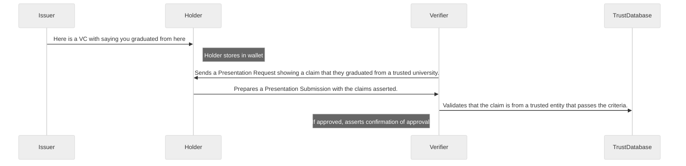

# Employment Verification Use Case

## Introduction

This is a full example flow of a student, getting a Verifiable Credential from a
University, and then using that credential to apply for a job. The verifier (
the company ), will then authorize the credential, if it trusts the source, and
grant access to the application process. 

```mermaid
graph TD
    %%{init: {'theme': 'neutral' } }%%
    Holder[Holder (Student)]
    Verifier[Verifier (Company)]
    Issuer[Issuer (University)]

    Issuer -->|Sends credential to holder saying the holder graduated from the university| Holder 
    Verifier -->|Sends a request to prove the holder graduated from the university| Holder 
    Holder -->|Sends a claim asserting that they did graduate from the university| Verifier
```

## Communication Diagram



## Steps

    0. Holder, Issuer, and Verifier all have wallets.
    1. Issuer sends a VC to the holder saying they graduated from the University. It has additionally information such as the degree they graduated with.
    2. Holder will store the VC in their wallet, "owning" the VC.
    3. The Verifier will request to validate the Holder graduated from a university using a Presentation Request.
    4. The Holder will respond with a Verified Submission, asserting the claim that they graduated from the university.
    5. If the Verifier trusts the university, they will authorize the next step. If not, they will reject the application.

## Output

An example of the output is shown below:


