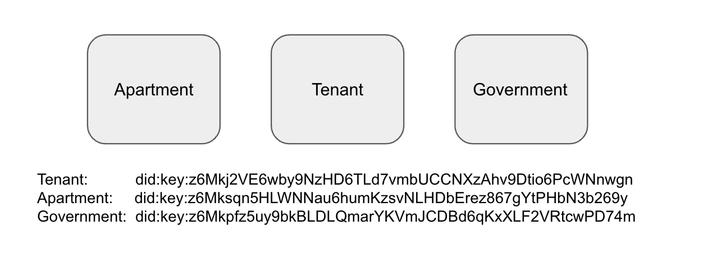

# Apartment Age Verification Use Case

# Introduction

This is a full example flow of an apartment verifying the age of a potential tenant. The flow goes as follows:

The apartment will create a presentation request that is to be fulfilled by the tenant. The tenant will fulfil the
Presentation Request by submitting a Presentation Submission. This presentation submission will contain a verifiable
credential that has been previously issued and signed from the government issuer. The tenant will verify that the
apartment's presentation request is valid and the apartment will also verify that the tenant's presentation submission
is valid.

At the end the apartment will verify the authenticity of the presentation submission and will be able to
cryptographically verify the birthdate of the tenant.

## Step 1

Create new decentralized identities for an apartment, a government agency, and a future tenant.



## Step 2

Government issuer using the holder’s DID issues credentials claiming age. The government issuer then signs the
verifiable credentials to holder claiming age


## Step 3

Create Presentation Definition from the apartment to the holder which goes into a presentation request.
The apartment is saying "here tenant, here is my what information I am requesting from you"


## Step 4

The tenant verifies the presentation request from the apartment is valid and then constructs and signs a presentation
submission


## Step 5

The apartment verifies that the presentation submission is valid and then can cryptographically verify that the
birthdate of the tenant is authentic. The tenant now has their age verified and they can move into the apartment! 🎉


# Running

Navigate to the ssi-sdk/example/use_cases/apartment_application directory and run

```
go run apartment_application.go
```

# Output

```
**Step 1:** Create new DIDs for entities

Tenant: `did:key:z6Mkj2VE6wby9NzHD6TLd7vmbUCCNXzAhv9Dtio6PcWNnwgn`
Apartment: `did:key:z6Mksqn5HLWNNau6humKzsvNLHDbErez867gYtPHbN3b269y`
Government: `did:key:z6Mkpfz5uy9bkBLDLQmarYKVmJCDBd6qKxXLF2VRtcwPD74m`


**Step 2:** Government issues Verifiable Credential new for tenant verifying birthdate and signs

```

Verifiable Credential:{
"@context": [
"https://www.w3.org/2018/credentials/v1"
],
"id": "1b81525a-ae7f-4f90-94ef-ebb04e348556",
"type": [
"VerifiableCredential"
],
"issuer": "did:key:z6Mkpfz5uy9bkBLDLQmarYKVmJCDBd6qKxXLF2VRtcwPD74m",
"issuanceDate": "2020-01-01T19:23:24Z",
"credentialSubject": {
"birthdate": "1975-01-01",
"id": "did:key:z6Mkj2VE6wby9NzHD6TLd7vmbUCCNXzAhv9Dtio6PcWNnwgn"
}
}

```

**Step 3:** The apartment creates a presentation request that confirms which information is required from the tenant

Presentation Definition that gets added to presentation request:

```

{
"id": "48e93dce-12a0-4cf7-a016-44927c98e4dc",
"input_descriptors": [
{
"id": "birthdate",
"purpose": "Age verification",
"format": {
"jwt_vc": {
"alg": [
"EdDSA"
]
}
},
"constraints": {
"fields": [
{
"path": [
"$.credentialSubject.birthdate"
],
"id": "birthdate"
}
]
}
}
]
}

```

**Step 4:** The holder creates a presentation submission to give to the apartment

Presentation Claim that gets added to presentation submission:

```

{
"Credential": null,
"Presentation": null,
"LDPFormat": null,
"Token": "{\"@context\":[
\"https://www.w3.org/2018/credentials/v1\"],\"id\":\"1b81525a-ae7f-4f90-94ef-ebb04e348556\",\"type\":[\"VerifiableCredential\"],\"issuer\":\"did:key:z6Mkpfz5uy9bkBLDLQmarYKVmJCDBd6qKxXLF2VRtcwPD74m\",\"issuanceDate\":\"2020-01-01T19:23:24Z\",\"credentialSubject\":{\"birthdate\":\"1975-01-01\",\"id\":\"did:key:z6Mkj2VE6wby9NzHD6TLd7vmbUCCNXzAhv9Dtio6PcWNnwgn\"}}"
,
"JWTFormat": "jwt_vc",
"SignatureAlgorithmOrProofType": "EdDSA"
}

```

**Step 5:** The apartment verifies that the presentation submission is valid and then can cryptographically verify that the birthdate of the tenant is authentic

🎉 The tenant's age has now been verified and can now move into the apartment! 🎉

```